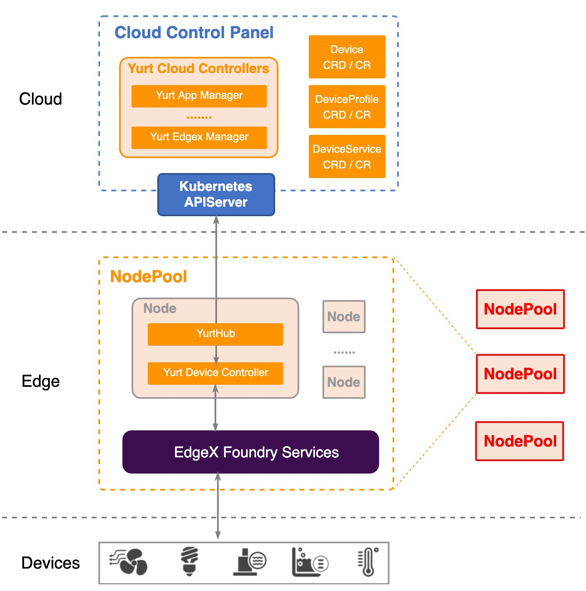

# Yurt-device-controller

This repository contains three CRD/controllers, Device, DeviceService and DeviceProfile:

- The `DeviceProfile` defines a type of devices using same kind of protocol, which includes some generic information like the manufacturer's name, the device description, and the device model. DeviceProfile also defines what kind of resources (e.g., temperature, humidity) this type of device provided and how to read/write these resources.

- The `DeviceService` defines the way of how to connect a device to the OpenYurt, like the URL of the device. The `DeviceService` can not exist alone. Every `DeviceService` must associate with a `DeviceProfile`.

- The `Device` is used to refer to a sensor, actuator, or IoT "thing", it gives the detailed definition of a specific device, like which `DeviceProfile` it belongs to and which `DeviceService` it used to connect to the system.

For details of the design, please see the [document](https://github.com/openyurtio/openyurt/blob/master/docs/proposals/20210310-edge-device-management.md).

## Architecture

Yurt-device-controller introduces an approach leverages existing edge computing platforms, like EdgeX Foundry, and uses Kubernetes custom resources to abstract edge devices.
Inspiring by the Unix philosophy, "Do one thing and do it well", we believe that Kubernetes should focus on managing computing resources while edge devices management can be done by adopting existing edge computing platforms.
Therefore, we define several generic custom resource definitions(CRD) that act as the mediator between OpenYurt and the edge platform.
Any existing edge platforms can be integrated into the OpenYurt by implementing custom controllers for these CRDs. These CRDS and corresponding controllers allow users to manage edge devices in a declarative way, which provides users with a Kubernetes-native experience and reduces the complexity of managing, operating and maintaining edge platform devices.

The major Yurt-Device-Controller components consist of:

- **Device controller**: It can abstract device objects in the edge platform into device CRs and synchronize them to the cloud. With the support of device controller, users can influence the actual device on the edge platform through the operation of cloud device CR, such as creating a device, deleting a device, updating device attributes (such as setting the light on and off, etc.).
- **DeviceService controller**: It can abstract deviceService objects in the edge platform into deviceService CRs and synchronize them to the cloud. With the support of deviceService Controller, users can view deviceService information of edge platforms in the cloud, and create or delete deviceService CRs to affect the actual deviceService of edge platforms.
- **DeviceProfile controller**: It can abstract deviceProfile objects in the edge platform into deviceProfile CRs and synchronize them to the cloud. With the support of deviceProfile Controller, users can view deviceProfile information of edge platforms in the cloud, and create or delete deviceProfile CRs to affect the actual deviceService of edge platforms.

## Getting Start

To use the yurt-device-controller, you need to deploy the OpenYurt cluster in advance and meet the following two conditions:

- Deploy the yurt-app-manager, the details of yurt-app-manager are in [here](https://github.com/openyurtio/yurt-app-manager) ；
- Deploy an Edgex Foundry instance in a NodePool by using yurt-edgex-manager, the details of yurt-edgex-manager are in [here](https://github.com/openyurtio/yurt-edgex-manager) .

For a complete example, please check out the [tutorial](docs/yurt-device-controller-tutorial.md)

## Contributing

Contributions are welcome, whether by creating new issues or pull requests. See our [contributing document](https://github.com/openyurtio/openyurt/blob/master/CONTRIBUTING.md) to get started.

## Contact

- Mailing List: openyurt@googlegroups.com
- Slack: [channel](https://join.slack.com/t/openyurt/shared_invite/zt-iw2lvjzm-MxLcBHWm01y1t2fiTD15Gw)
- Dingtalk Group (钉钉讨论群)

    

## License

Yurt-device-controller is under the Apache 2.0 license. See the [LICENSE](LICENSE) file for details. Certain implementations in Yurt-device-controller rely on the existing code from [Kubernetes](https://github.com/kubernetes/kubernetes) and [OpenKruise](https://github.com/openkruise/kruise) the credits go to the original authors.